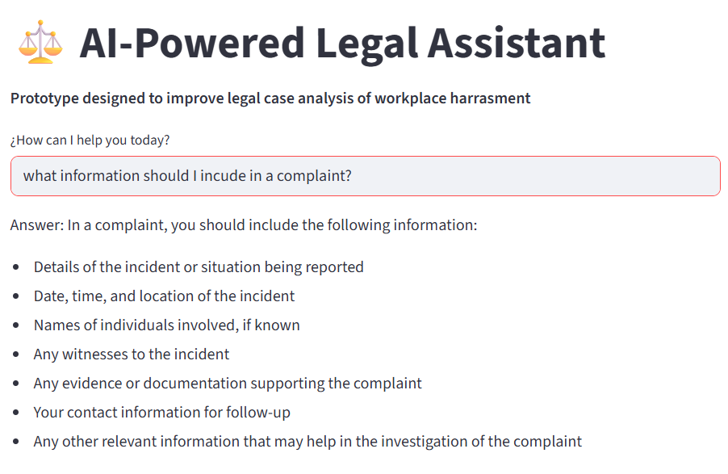
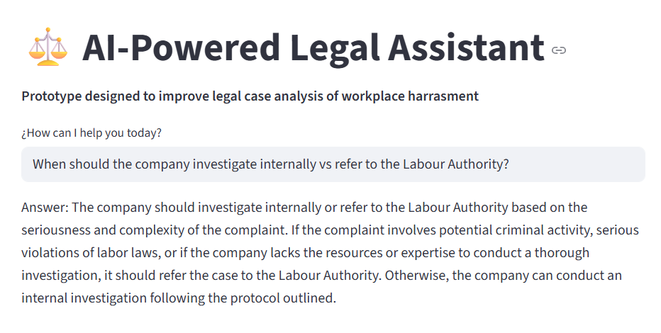
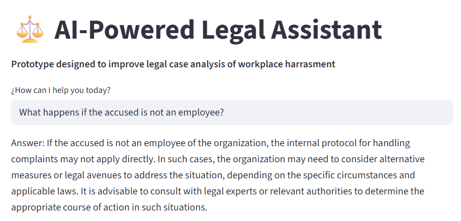

# AI Knowledge Assistant  
AI-Powered Decision Support System for Case-Based Processes

## Live Demo
https://ai-document-assistant0.streamlit.app/

---
## Application Preview

### 1. Complaint Data Requirements

The system helps users identify the required information to properly structure a workplace complaint, ensuring completeness and compliance with the investigation process.

---

### 2. Investigation Decision Support

The assistant supports decision-making by guiding users on whether a case should be handled internally or escalated to the Labour Authority, based on procedural logic.

---

### 3. Complex Case Handling

The system can assist with complex scenarios, such as cases involving individuals outside the organisation, helping users understand how procedures apply in non-standard situations.

---

## Project Overview

This project was inspired by a real-world scenario involving an organisation that manages case-based processes related to workplace complaints.

The organisation relied heavily on structured documentation and expert knowledge to handle investigations, creating an opportunity to improve accessibility, consistency and efficiency through AI.

To ensure confidentiality, all data used in this project has been anonymised or simulated.

---

## Business Problem

Organisations managing sensitive processes (e.g. workplace investigations, compliance procedures) often face:

- Fragmented knowledge stored across documents  
- Time-consuming manual search processes  
- High reliance on expert interpretation  
- Risk of inconsistent decisions  
- Limited scalability of internal expertise  

---

## Solution

This project demonstrates how AI can transform static documentation into an interactive decision-support system.

The solution:

- Centralises procedural knowledge  
- Enables natural language queries  
- Retrieves relevant document sections  
- Generates contextual responses  
- Supports users through complex workflows  

---

## Key Capabilities

- Case-based knowledge retrieval  
- Process guidance through structured procedures  
- Context-aware response generation  
- Support for compliance-driven workflows  
- Scalable document ingestion  

---

## How It Works

The system uses a Retrieval-Augmented Generation (RAG) architecture:

1. Documents are ingested into the system  
2. Content is segmented into smaller chunks  
3. Embeddings are generated for semantic search  
4. User queries are matched to relevant content  
5. The AI model generates contextual responses based on retrieved data  

---

## Knowledge Base

The current implementation uses a structured procedural document that includes:

- End-to-end investigation workflow  
- Defined process stages  
- Business rules and compliance principles  
- Required inputs (complaints, evidence, witnesses)  
- Outputs (reports, decisions, sanctions)  

This enables the system to simulate a real-world operational environment for case-based decision-making.

---

## Business Impact

This solution demonstrates how AI can:

- Reduce time spent searching for information  
- Improve consistency in decision-making  
- Increase accessibility to institutional knowledge  
- Support process standardisation  
- Enable scalable knowledge systems  

---

## Business Analyst Perspective

This project reflects core Business Analyst capabilities:

- Problem identification in real-world business context  
- Translation of complex documentation into structured workflows  
- Definition of inputs, outputs and decision points  
- Design of a digital solution aligned with business needs  
- Application of AI to improve operational processes  
- Ability to bridge business needs and technical implementation  

---

## Technology Stack

- Python  
- Streamlit  
- LangChain  
- OpenAI API (LLM for response generation)  
- Vector database (FAISS)  

---

## Delivery Model (Conceptual)

The solution can be deployed as:

- Web-based application  
- Internal enterprise tool (intranet integration)  
- Knowledge assistant for operational teams  

---

## Limitations

- Responses are limited to the content of the ingested documents  
- The system does not replace professional or legal advice  
- Performance depends on document quality and structure  
- No real-time data integration  

This reflects typical constraints of early-stage AI solutions and highlights areas for future development.

---

## Future Improvements

- Multi-document knowledge base  
- Role-based access control  
- Source referencing in responses  
- Evaluation metrics for response quality  
- Admin dashboard for knowledge management  
- Integration with enterprise systems  

---

## Portfolio Summary

Designed and developed an AI-powered knowledge assistant to support case-based processes through natural language interaction.

This project demonstrates the ability to identify a real business problem, design a scalable AI-driven solution, and deliver a functional MVP that improves knowledge accessibility, process efficiency and decision-making.
